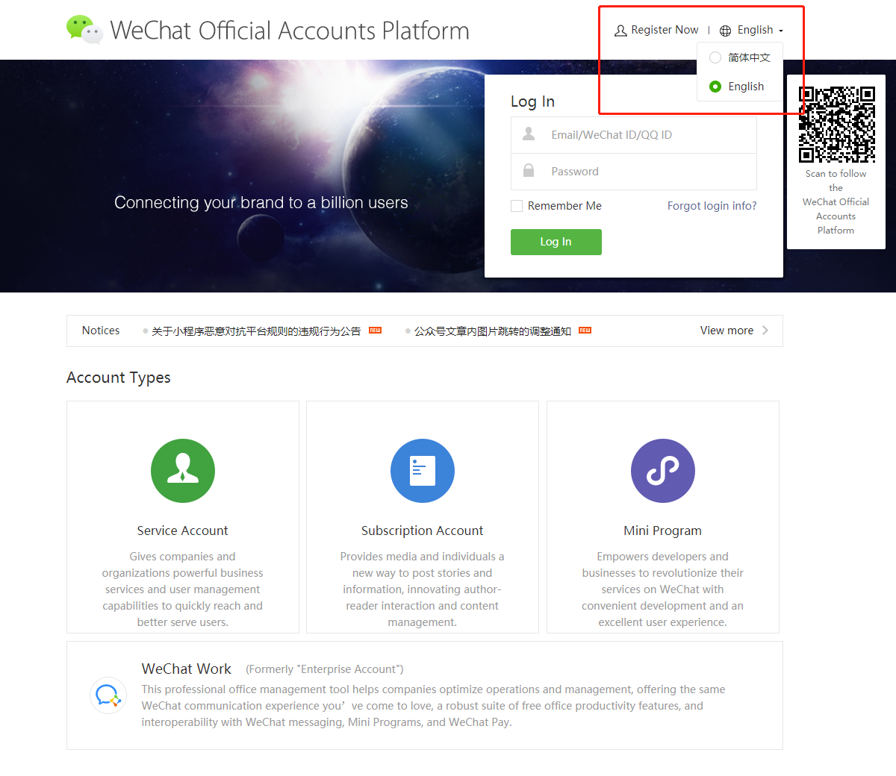
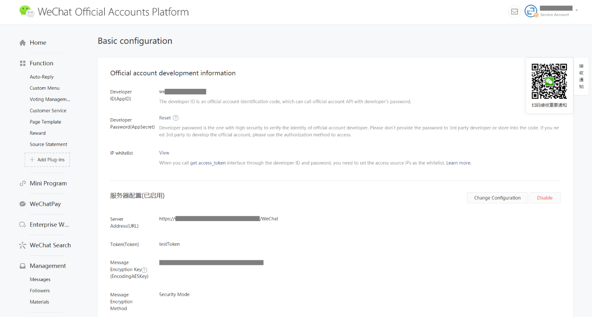
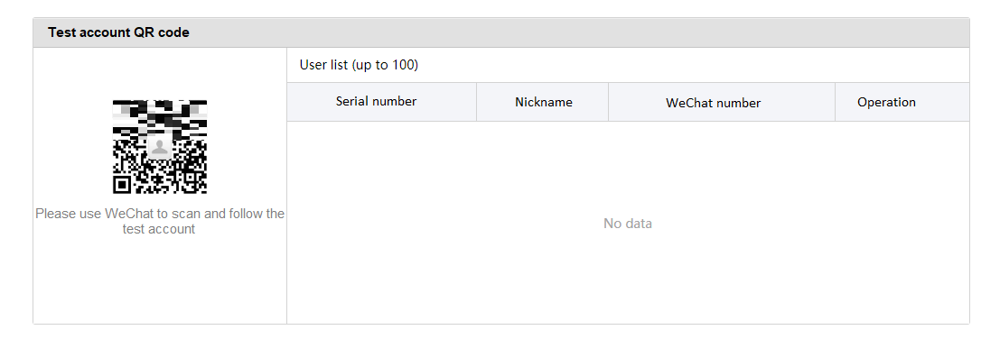
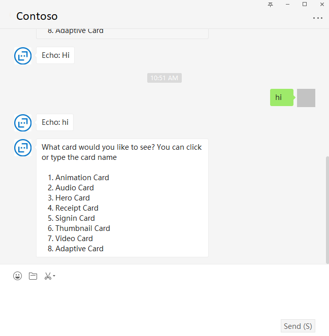

# WeChat Adapter Document

## Connect WeChat through the WeChat adapter

To configure a bot to communicate using WeChat, create a WeChat official account on [WeChat Official Account Platform](https://mp.weixin.qq.com/?lang=en_US) and then connect the bot to the app.

## Change your prefer language first

Document language can only be set before login.

 

## Create an account

### Registry a real Service Account

A real service account must be registered by a company and verified by WeChat, you can register your own service account at [WeChat Official Account Platform](https://mp.weixin.qq.com/?lang=en_US)

For Testing Please use a sandbox account.

### Sandbox Account

Open link below to create a sandbox account

[https://mp.weixin.qq.com/debug/cgi-bin/sandbox?t=sandbox/login](https://mp.weixin.qq.com/debug/cgi-bin/sandbox?t=sandbox/login)

You will see page below when you created the test account.

### Setup appsettings.json

You will need to set up appsettings.json before start up the bot, you can find what you need below.

#### Service account

If you already have a service account and ready to deploy, then you can find **AppID** , **AppSecret** , **EncodingAESKey** and **Token** in the basic configurations, like below.
Don't forgot you need to set up the IP white list, otherwise WeChat won't accept your request.
 

#### Sandbox account

 

Sandbox account don't have **EncodingAESKey** , message from WeChat was not encrypted just leave EncodingAESKey blank. You only have three parameters here, **appID** , **appsecret** and **Token**.

### Startup Bot and set endpoint URL

Now you can set your bot backend. Before you are doing this, you have to startup the bot because WeChat require the webhook URL verified.

Please set the endpoint in such pattern: <https://your\_end\_point/WeChat>

## Enable WeChat Adapter to bot

### Add reference to WeChat adapter source

Please directly reference the WeChat adapter project for now, before we have a stable version of package source.
The local version of Nuget packages are under /botbuilder-dotnet/outputpackages

### Inject WeChat adapter in Startup.cs

Put these code in Startup.cs to inject the WeChat Adapter.

```csharp

        // Load WeChat settings.
        var wechatSettings = new WeChatSettings();
        Configuration.Bind("WeChatSettings", wechatSettings);
        services.AddSingleton<WeChatSettings>(wechatSettings);

        // Configure hosted serivce.
        services.AddSingleton<IBackgroundTaskQueue, BackgroundTaskQueue>();
        services.AddHostedService<QueuedHostedService>();
        services.AddSingleton<WeChatAdapterWithErrorHandler>();

```

### Put some code in **BotController.cs**

```csharp
namespace Microsoft.Bot.Builder.Adapters.WeChat.TestBot
{
    // This ASP Controller is created to handle a request. Dependency Injection will provide the Adapter and IBot
    // implementation at runtime. Multiple different IBot implementations running at different endpoints can be
    // achieved by specifying a more specific type for the bot constructor argument.
    [Route("api/messages")]
    [ApiController]
    public class BotController : ControllerBase
    {
        private readonly IBot _bot;
        private readonly WeChatHttpAdapter _wechatHttpAdapter;

        public BotController(IBot bot, WeChatHttpAdapter wechatAdapter)
        {
            _bot = bot;
            _wechatHttpAdapter = wechatAdapter;
        }

        [HttpGet("/WeChat")]
        [HttpPost("/WeChat")]
        public async Task PostWeChatAsync([FromQuery] SecretInfo secretInfo)
        {
            // Delegate the processing of the HTTP POST to the adapter.
            // The adapter will invoke the bot.
            await _wechatHttpAdapter.ProcessAsync(Request, Response, _bot, secretInfo);
        }
    }
}

```

### Set your Token and Bot webhook URL to the WeChat web page

Start your bot first because WeChat will verify the webhook URL by sending a request.

 

### Subscribe your official account

You can find a QR code to subscribe your test account as in WeChat.

 

## Test through WeChat

Everything is done, you can try it in your WeChat.

 
